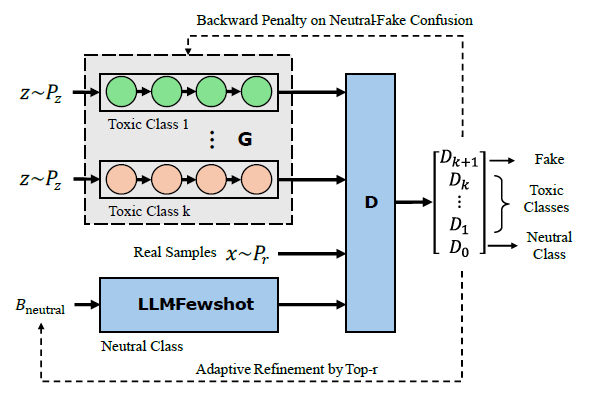
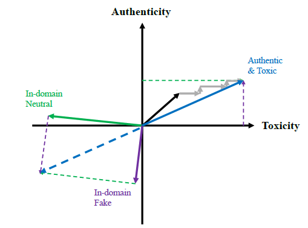

# ToxiGAN

**Toxic data augmentation via LLM-guided directional adversarial generation.**

Toxicity classifiers are trained on data where roughly nine in ten comments are
harmless. That imbalance pushes models toward the easy majority answer and away
from the rare toxic cases that are the entire point of the system. ToxiGAN
attacks the problem from the data side: it trains a small family of LSTM
generators to write synthetic toxic comments, then adds them to the training set
to bring the imbalance from ~9:1 down to ~3.5:1.

The repository contains two loosely coupled halves:

| Half | Directory | Job |
|---|---|---|
| **Generation** | `generation_fixed/gen_fix/` | Train 4 class-specific generators against a BERT critic and an LLM neutral-text provider. Emit 40,000 synthetic toxic sentences. |
| **Detection** | `detection/` | Filter those sentences, augment a real training set with them, and measure the effect on three classifiers in-domain and cross-dataset. |

They communicate through exactly one file — `artifacts/data_gen_toxigan.json` —
so the detection benchmark can be run against synthetic data from any source.

---

## Contents

- [How it works](#how-it-works)
- [Repository layout](#repository-layout)
- [Setup](#setup)
- [Running the pipeline](#running-the-pipeline)
- [Configuration](#configuration)
- [Results](#results)
- [Known issues](#known-issues)
- [Credits](#credits)

---

## How it works

### Three players

**K toxic generators** (`generator.py`) — one per toxic class, so K = 4 for
`toxic`, `obscene`, `insult`, `identity_hate`. Each is a single-layer LSTM
(300-d embeddings, 1024-d hidden state) that samples a fixed 20 tokens
autoregressively from its own word-level vocabulary. Each is pretrained with
teacher forcing and cross-entropy on its own class file before any adversarial
step.

**A multi-class discriminator** (`discriminator.py`) — `bert-base-uncased` plus
a highway layer and a linear head over **K + 2 = 6** classes: one neutral, four
toxic, and one `fake` class that absorbs unrealistic generations. Because the
generators and BERT use different vocabularies, generator output is decoded to a
string and re-tokenised by BERT's WordPiece tokeniser (`trans_vocab`). No
gradient crosses that boundary, which is why the generators are trained by
policy gradient rather than backpropagation.

**An LLM neutral-text provider** (`llm_neutral_provider.py`) — a local model
served by [Ollama](https://ollama.ai/) that supplies in-domain neutral
sentences via 5-shot prompting. The five in-prompt examples are not fixed: each
adversarial round scores the neutral pool with the current discriminator
(P(class 0)), drops the bottom half, and re-draws the examples from the top 100
survivors. The prompt therefore drifts toward whatever the critic currently
regards as most clearly neutral. This is the *LLM-ballast* mechanism — the fixed
reference point the toxic generators are pushed away from.

### Two-step alternating directional learning

Generators are updated with REINFORCE. Per-token rewards come from Monte Carlo
rollout (`rollout.py`): freeze the first *t* tokens, complete the sequence
`ROLL_OUT_NUM` times, score each completion, average. The rounds alternate
between two directions:

| Round | `penalty_type` | Signal | Intent |
|---|---|---|---|
| even | `tox` | max cosine similarity to the neutral anchor set, via `all-MiniLM-L6-v2` sentence embeddings | move output away from the neutral region |
| odd | `dis` | `1 − P(discriminator says target toxic class)` | move output toward authentic in-class text |

In embedding space, each generator's output cloud is pushed along one axis and
then the other, round by round. After each round the discriminator is refreshed
for `DIS_UPDATES_PER_ROUND` passes on real samples + current fakes + fresh LLM
neutrals, and all checkpoints are written to `artifacts/`.





> The direction of the reward term in `train.py` is currently under review — see
> [Known issues](#known-issues) before relying on the learning dynamics.

### Downstream evaluation

Cleaned synthetic samples are appended to the real training split (labelled
toxic) and three deliberately different classifiers are trained twice each,
baseline vs augmented:

| Classifier | Type | Why it's here |
|---|---|---|
| **DistilBERT** | fine-tuned transformer | strong, realistic baseline |
| **BiLSTM** | 2-layer bidirectional LSTM, trained from scratch | no pretrained knowledge, so it has the most to gain from extra data — the cleanest test of whether the augmentation carries information |
| **TF-IDF + LogReg** | classical, 50k uni/bigram features | checks whether the augmentation helps even without a neural model |

All three use inverse-frequency class weights, so **the baseline is already
imbalance-corrected** — augmentation has to beat a defended baseline, not a
naive one. Validation and test splits stay 100% real; only the training split is
augmented.

Evaluation runs in two modes: **in-domain** (train on Jigsaw, test on held-out
Jigsaw) and **cross-dataset** (train on Jigsaw, test on
[Davidson](https://huggingface.co/datasets/hate_speech_offensive) tweets and
[HateXplain](https://huggingface.co/datasets/hatexplain), both collapsed to
binary).

---

## Repository layout

> **Note on paths.** The generation code lives under
> `generation_fixed/gen_fix/`, not at the repository root. Both
> `config.py` and `scripts/download_data.py` resolve the project root by walking
> up the tree, and both land on **`generation_fixed/gen_fix/`** — so data,
> artifacts and checkpoints are created *there*, not next to this README.
> Modules also import each other by bare name (`from config import parse_opt`),
> so **every script must be run from the directory it lives in.**

```
ToxiGAN/
├── configs/
│   └── default.yaml                  # reference values only — not read by any script
│
├── figures/
│   ├── Framework.png
│   └── Two-Step.png
│
├── generation_fixed/gen_fix/         # ← effective project root for generation
│   ├── generation/
│   │   ├── config.py                 # all hyperparameters (argparse defaults)
│   │   ├── train.py                  # vocab build → pretrain G → pretrain D → adversarial loop
│   │   ├── resume_training.py        # adversarial loop only, from checkpoints
│   │   ├── generate_samples.py       # 4 × 10,000 sentences → JSON
│   │   ├── generator.py              # LSTM generator
│   │   ├── discriminator.py          # BERT + highway + (K+2)-class head
│   │   ├── rollout.py                # Monte Carlo rollout, per-token rewards
│   │   ├── penalty_loss.py           # sentence-embedding similarity to neutral anchors
│   │   ├── llm_neutral_provider.py   # Ollama client + evolving few-shot pool
│   │   ├── dataloader.py             # datasets over tokenised .id files
│   │   └── utils.py
│   ├── scripts/
│   │   └── download_data.py          # Jigsaw → per-class .txt files
│   ├── data/raw/                     # created by download_data.py (gitignored)
│   │   ├── nor.txt  toxic.txt  obscene.txt  insult.txt  identity_hate.txt
│   └── artifacts/                    # created by train.py (gitignored)
│       ├── vocab.txt  *.id
│       ├── generator_toxic_*.pt  discriminator.pt
│       └── data_gen_toxigan.json
│
├── detection/
│   ├── multi_classifier.py           # main experiment: 3 classifiers × 2 settings × 2 eval modes
│   ├── train_classifier.py           # DistilBERT only — faster to iterate on
│   ├── test_cross_dataset.py         # score saved checkpoints on Davidson / HateXplain
│   ├── model.py                      # DistilBERT + classification head
│   ├── dataset.py                    # Jigsaw loading, splits, external dataset loaders
│   ├── data_cleaning.py              # 7 quality filters over generated text
│   └── metrics.py                    # metrics + comparison printer
│
├── requirements.txt
└── README.md
```

---

## Setup

**Requirements:** Python 3.10+, a CUDA GPU (strongly recommended — the rollout
loop is CPU-bound otherwise), and Ollama running locally.

```bash
conda create -n toxigan python=3.11 -y
conda activate toxigan

# PyTorch — match your CUDA version
pip install torch torchvision torchaudio --extra-index-url https://download.pytorch.org/whl/cu121

pip install -r requirements.txt
```

### Ollama

```bash
ollama serve                          # in a separate terminal
ollama pull qwen2.5:14b-instruct
export OLLAMA_MODEL=qwen2.5:14b-instruct
export OLLAMA_HOST=http://localhost:11434    # optional, this is the default
```

Verify the provider before starting a multi-hour training run:

```bash
cd generation_fixed/gen_fix/generation
python llm_neutral_provider.py        # should print 5 neutral sentences
```

If Ollama is unreachable, training does not crash — the provider falls back to
sampling real neutral sentences from `nor.txt`. Check the output above rather
than assuming the LLM half is active.

---

## Running the pipeline

### Step 1 — download the data

```bash
cd generation_fixed/gen_fix/scripts
python download_data.py                       # → ../data/raw/*.txt
python download_data.py --max_neutral 20000   # larger neutral pool (default is 5,000)
```

Five files are written: one per toxic class, plus `nor.txt` for comments where
all six Jigsaw flags are zero. The toxic files **overlap** by design — Jigsaw is
multi-label, so a comment flagged both obscene and insulting trains two
generators.

`nor.txt` is capped at 5,000 lines by default while the toxic files are taken
whole. Since the neutral set is the reference point both the discriminator and
the `tox` penalty depend on, raising that cap is usually worth the disk.

### Step 2 — verify config resolution

```bash
cd generation_fixed/gen_fix/generation
python config.py
```

Prints the resolved root, data and artifact directories and a ✓/✗ per data file.
Do this before training; a silent path mismatch costs hours.

### Step 3 — train the generators

```bash
cd generation_fixed/gen_fix/generation
export OLLAMA_MODEL=qwen2.5:14b-instruct
python train.py
```

Three stages run in sequence:

1. **Generator pretraining** — `PRETRAIN_EPOCHS_G` (350) epochs per class, 4 classes
2. **Discriminator pretraining** — `PRETRAIN_EPOCHS_D` (30) epochs on real + LLM-neutral + fake
3. **Adversarial training** — `TOTAL_BATCH × 2` (80) alternating rounds

Checkpoints are written to `../artifacts/` after every adversarial round, so the
run is safe to interrupt. To continue:

```bash
python resume_training.py --start_batch 5 --total_batches 25
```

This skips both pretraining stages and loads `generator_toxic_*.pt` and
`discriminator.pt` from `../artifacts/`.

> **Expect this to take a long time.** The rollout is the bottleneck:
> `ROLL_OUT_NUM × MAX_SEQ_LENGTH × BATCH_SIZE` = 16 × 20 × 128 ≈ 41,000
> sequential single-token LSTM walks per generator per round, in plain Python
> loops. Reduce `ROLL_OUT_NUM` or `BATCH_SIZE` for a smoke test.

### Step 4 — generate samples

```bash
cd generation_fixed/gen_fix/generation
python generate_samples.py            # → ../artifacts/data_gen_toxigan.json
```

Produces `gen_num` (10,000) sentences per class, 40,000 total:

```json
{
  "tweet": ["...", "..."],
  "class": ["0", "0", "...", "3"]
}
```

`class` records the generating model's index. Note that the detection side does
not currently use it — all samples are collapsed to a single binary toxic label.

### Step 5 — train and evaluate the detectors

Run from inside `detection/` (the scripts import their siblings by bare name):

```bash
cd detection

# Full experiment — 3 classifiers × baseline/augmented × in-domain + cross-dataset
python multi_classifier.py \
    --generated_data ../generation_fixed/gen_fix/artifacts/data_gen_toxigan.json

# Faster: DistilBERT only, saves both checkpoints
python train_classifier.py \
    --generated_data ../generation_fixed/gen_fix/artifacts/data_gen_toxigan.json

# Cross-dataset scoring of the checkpoints saved above
python test_cross_dataset.py --dataset davidson
python test_cross_dataset.py --dataset hatexplain
```

Useful flags for `multi_classifier.py`:

| Flag | Effect |
|---|---|
| `--quick_test` | caps data at 5k/500/500 — use this first, it finishes in minutes |
| `--classifiers distilbert bilstm` | run a subset |
| `--skip_cross_dataset` | in-domain only |
| `--epochs`, `--lstm_epochs`, `--lr`, `--batch_size` | training overrides |
| `--splits_dir` | where train/val/test Parquet caches live (reused across runs for identical splits) |

Outputs land under `detection/outputs/multi_classifier/`:
`full_analysis_report.json` plus DistilBERT checkpoints.

### Data cleaning

`data_cleaning.py` filters generated text before augmentation, and its rejection
counters are the fastest read on generator health:

| Filter | Rejects | Reading a high count |
|---|---|---|
| `empty`, `too_short` | ≤ 2 words | EOS sampled far too early |
| `high_unk` | > 30% `<UNK>` | vocabulary cut-off too aggressive for this corpus |
| `repetitive` | one token > 50% of text | **mode collapse** — the generator found one high-reward phrase |
| `non_alpha` | < 50% alphabetic words | generic degeneration |
| `short_after_clean` | ≤ 2 words after stripping `<UNK>` | the sample was only held up by `<UNK>` |

Roughly 60% of the 40,000 typically survive.

---

## Configuration

All hyperparameters live as argparse defaults in
`generation_fixed/gen_fix/generation/config.py`. **`configs/default.yaml` is not
read by any script** — treat it as documentation until a loader is added.

| Parameter | Default | Notes |
|---|---|---|
| `PRETRAIN_EPOCHS_G` | 350 | per class, 4 classes |
| `PRETRAIN_EPOCHS_D` | 30 | |
| `EMB_DIM` / `HIDDEN_DIM` | 300 / 1024 | generator LSTM |
| `MAX_SEQ_LENGTH` | 20 | also the corpus filter: only 2–19 word comments survive preprocessing |
| `BATCH_SIZE` | 128 | |
| `TOTAL_BATCH` | 40 | adversarial loop runs `2 ×` this, alternating penalties |
| `ROLL_OUT_NUM` | 16 | dominant cost |
| `DIS_UPDATES_PER_ROUND` | 4 | |
| `learning_rate_g` / `learning_rate_d` | 1e-4 / 1e-4 | Adam |
| `dis_l2_reg_lambda` | 0.2 | see [Known issues](#known-issues) |
| `gen_num` | 10,000 | samples per class at generation time |
| `SEED` | 42 | |

`dis_filter_sizes` and `dis_num_filters` are inherited from the SeqGAN CNN
discriminator and are unused by `BertDiscriminator`.

---

## Results

Jigsaw held-out test set, single run at seed 42. Δ rows are augmented − baseline.

| Classifier | Setting | Accuracy | Precision | Recall | F1 | AUC-ROC |
|---|---|---|---|---|---|---|
| DistilBERT | baseline | 0.9430 | 0.9266 | **0.9623** | 0.9441 | 0.9871 |
| DistilBERT | augmented | **0.9453** | **0.9419** | 0.9492 | **0.9456** | **0.9872** |
| | Δ | +0.0023 | +0.0153 | −0.0131 | +0.0015 | +0.0001 |
| BiLSTM | baseline | 0.8636 | **0.9347** | 0.7821 | 0.8516 | **0.9454** |
| BiLSTM | augmented | **0.8644** | 0.8656 | **0.8630** | **0.8643** | 0.9407 |
| | Δ | +0.0008 | −0.0691 | +0.0809 | +0.0127 | −0.0047 |
| TF-IDF+LR | baseline | 0.9002 | 0.9127 | 0.8853 | 0.8988 | 0.9621 |
| TF-IDF+LR | augmented | 0.9002 | 0.9127 | 0.8853 | 0.8988 | 0.9621 |
| | Δ | 0.0000 | 0.0000 | 0.0000 | 0.0000 | 0.0000 |

Cross-dataset, augmented models on Davidson (Twitter hate speech), trained only
on Jigsaw (Wikipedia comments):

| Classifier | Accuracy | Precision | Recall | F1 | AUC-ROC |
|---|---|---|---|---|---|
| **DistilBERT** | **0.8711** | 0.9088 | **0.9394** | **0.9238** | **0.9223** |
| TF-IDF+LR | 0.8259 | **0.9136** | 0.8734 | 0.8930 | 0.8462 |
| BiLSTM | 0.7803 | 0.9035 | 0.8239 | 0.8619 | 0.7939 |

### What these numbers do and don't support

**Cross-domain transfer is real.** DistilBERT holds 0.9238 F1 and 0.9223 AUC on
Davidson tweets after training only on Wikipedia comments. The ordering —
DistilBERT 0.92 AUC, TF-IDF 0.85, from-scratch BiLSTM 0.79 — is the most robust
result here, and it says pretraining dominates. Note that this table has no
baseline arm, so it speaks to transfer, not to augmentation.

**The in-domain augmentation effects are not yet established.** Three reasons to
read the Δ column cautiously:

- **DistilBERT's +0.0015 F1 is within seed noise.** A single seed cannot
  distinguish it from zero. The composition is also worth noting: precision
  +1.5, recall −1.3 — the augmented model became more conservative, not more
  discriminating.
- **BiLSTM's +0.0127 F1 comes with AUC going down** (0.9454 → 0.9407). AUC is
  threshold-free; if it falls while F1 rises, ranking quality did not improve
  and the gain is a threshold shift, which adding minority-class data naturally
  produces. A claim of better discrimination needs a gain at matched precision,
  or a gain in AUC.
- **The TF-IDF rows are identical to four decimals across all five metrics**,
  AUC included. Two independently fitted pipelines over datasets differing by
  ~25,000 documents would not agree that exactly. This row needs re-running
  before it is reported.

See [Known issues](#known-issues) for what would settle these.

---

## Known issues

Open items, roughly by impact. Contributions welcome.

### Correctness

- **Rollout does not condition on the prefix.** In `rollout.py` each Monte Carlo
  continuation starts from `h, c = None, None` and is fed only `cur[-1]`, so the
  frozen prefix is never run through the LSTM to build hidden state. Each
  continuation is conditioned on one token rather than *t*, which undercuts the
  per-position credit assignment the rollout exists to provide.
- **Reward direction needs verifying against the paper.** `compute_penalty()`
  returns *similarity to the neutral anchor set*, and `train.py` assigns it to
  `raw_reward` and maximises `Σ log P × reward`. Read literally, even rounds
  raise the probability of neutral-looking text and odd rounds raise the
  probability of text the discriminator does *not* assign to the target class —
  the opposite of the stated intent. In the SentiGAN formulation this descends
  from, the penalty multiplies probability inside a *minimised* loss.
- **The L2 term swamps the discriminator loss.**
  `l2_loss = sum(torch.norm(p) for p in dis_model.parameters())` sums the L2
  norms of every tensor in a ~110M-parameter BERT, then scales by 0.2. That term
  is orders of magnitude larger than the cross-entropy it is added to, so most
  of the gradient shrinks weights rather than teaching classification. Standard
  `weight_decay` on the optimiser is the correctly scaled equivalent.

### Experimental design

- **No variance estimates.** One run at seed 42 per cell. 3–5 seeds with
  mean ± std would settle the DistilBERT claim either way.
- **No cheap-augmentation baselines.** Class weights already handle plain
  imbalance. The comparison that matters is ToxiGAN against random oversampling,
  EDA-style synonym swaps, back-translation, and — most directly — 25,000 toxic
  sentences prompted straight out of the same Ollama model. The GAN machinery
  has to beat that last one to justify its cost.
- **Cross-dataset evaluation has no baseline arm.** Only augmented models are
  scored on Davidson and HateXplain. Adding the baseline models is a small
  change with a real payoff, since generalisation is where augmentation should
  help most.
- **Generated labels are unverified.** Every surviving sample is labelled toxic
  because a toxic-trained generator produced it, with no content check. Scoring
  the cleaned set with an off-the-shelf toxicity classifier, or hand-labelling
  200 samples, would quantify the label noise — the most likely explanation for
  a near-zero effect on DistilBERT.

### Design and performance

- **Per-class structure is discarded downstream.** Four generators, a
  (K+2)-class critic and class-specific rewards all collapse to one binary label
  at the handoff, so the architecture's central choice cannot affect the
  reported metric. Using the flavours downstream — multi-label detection, or
  per-flavour recall — would let the results speak to it.
- **The 20-token ceiling defines the synthetic corpus.** Only 2–19 word comments
  survive preprocessing, and generation is fixed at exactly 20 tokens with no
  EOS stopping in `Generator.sample()`. The augmentation therefore occupies a
  length regime the Jigsaw test set barely contains, while the detectors
  truncate at 128 tokens.
- **Rollout is ~100× slower than it needs to be.** The batch dimension is
  available and unused; rolling out all 128 sequences together instead of one at
  a time is the difference between hours and days.
- **`configs/default.yaml` is dead config,** and its values disagree with
  `config.py` (400 vs 350 pretrain epochs, 20 vs 40 adversarial batches). Either
  wire up a loader or delete it.
- **`.gitignore` contains a blanket `*.txt` rule,** which will silently ignore
  any intended `.txt` file anywhere in the tree.
- **No `LICENSE` file.** Without one, the default is all-rights-reserved, which
  blocks reuse the project probably wants to allow.

---

## Credits

This implementation follows the ToxiGAN method described in:

> Li, P., Fillies, J., & Paschke, A. (2026). *ToxiGAN: Toxic Data Augmentation
> via LLM-Guided Directional Adversarial Generation.* EACL 2026.
> [arXiv:2601.03121](https://arxiv.org/abs/2601.03121)

The training loop builds on two earlier sequence-GAN implementations:

- [SeqGAN](https://github.com/LantaoYu/SeqGAN) — Monte Carlo rollout and policy-gradient training for discrete sequences
- [SentiGAN](https://github.com/Nrgeup/SentiGAN) — multiple class-specific generators with a penalty-based objective

### Datasets

| Dataset | Use | Source |
|---|---|---|
| Jigsaw Toxic Comment | training, in-domain test | [`Arsive/toxicity_classification_jigsaw`](https://huggingface.co/datasets/Arsive/toxicity_classification_jigsaw), [`OxAISH-AL-LLM/wiki_toxic`](https://huggingface.co/datasets/OxAISH-AL-LLM/wiki_toxic) |
| Davidson | cross-dataset test | [`hate_speech_offensive`](https://huggingface.co/datasets/hate_speech_offensive) |
| HateXplain | cross-dataset test | [`hatexplain`](https://huggingface.co/datasets/hatexplain) |

Note that `detection/dataset.py` defaults to the Arsive version (~26k rows)
while `detection/multi_classifier.py` prefers `wiki_toxic` (~160k rows) and
falls back to Arsive. The two entry points are therefore not measuring the same
thing; they also cache splits to different directories.

---

## Intended use

This project exists to study class imbalance in content-moderation models. The
generators produce abusive text by design. Generated samples are training data
and are not fit for any other purpose; the `artifacts/` directory is gitignored
and generated output should not be published.
